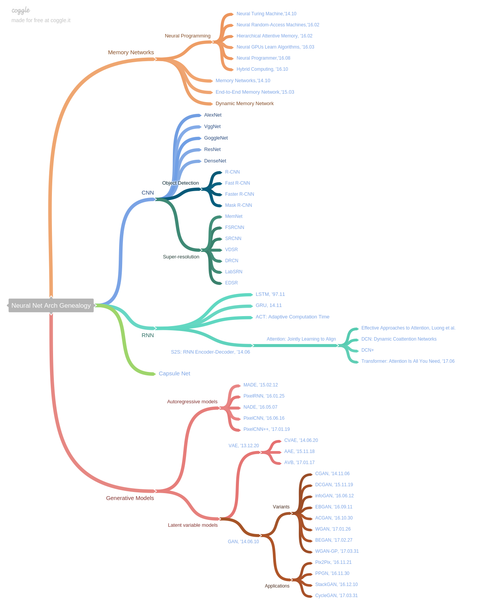

# Deep Architecture Genealogy
There are so many new models and architectures. If you find something interesting and worth paying attention to, please send us a pull requests (PR) and write issues.
`README.md` is automatically generated. Please send PRs on the `Neural Net Arch Genealogy.txt` file.## Mindmap Coggle Link
https://coggle.it/diagram/Wf5mYoJbsgABUF9P

## Text Version
This is automatically generated. Please send a PR on the `Neural Net Arch Genealogy.txt` file.
* Memory Networks
  * Neural Programming
    * [Neural Turing Machine,'14.10](https://arxiv.org/pdf/1410.5401.pdf)
    * [Neural Random-Access Machines,'16.02](https://arxiv.org/pdf/1511.06392.pdf)
    * [Hierarchical Attentive Memory, '16.02](https://arxiv.org/abs/1602.03218)
    * [Neural GPUs Learn Algorithms, '16.03](https://arxiv.org/pdf/1511.08228.pdf)
    * [Neural Programmer,'16.08](https://arxiv.org/pdf/1511.04834.pdf)
    * [Neural Module Networks, '16.06](https://www.cv-foundation.org/openaccess/content_cvpr_2016/html/Andreas_Neural_Module_Networks_CVPR_2016_paper.html)
    * [Hybrid Computing, '16.10](https://www.nature.com/nature/journal/v538/n7626/full/nature20101.html)
  * [Memory Networks,'14.10](https://arxiv.org/pdf/1410.3916.pdf)
  * [End-to-End Memory Network,'15.03](https://arxiv.org/pdf/1503.08895.pdf)
  * [DMN: Dynamic Memory Network, '16.03](https://arxiv.org/pdf/1506.07285.pdf),[DMN+, `16.04 ](https://arxiv.org/pdf/1603.01417.pdf) 
* CNN
  * AlexNet
  * VggNet
  * GoggleNet
  * ResNet
  * DenseNet
  * [SENet: Squeeze-and-Excitation Networks, '17.09](https://arxiv.org/abs/1709.01507)
  * Object Detection
    * [R-CNN](https://arxiv.org/pdf/1311.2524.pdf)
    * [Fast R-CNN](https://arxiv.org/pdf/1504.08083.pdf)
    * [Faster R-CNN](https://arxiv.org/pdf/1506.01497.pdf)
    * [Mask R-CNN](https://arxiv.org/pdf/1703.06870.pdf)
    * [YOLO](https://arxiv.org/pdf/1506.02640.pdf)
    * [SSD](https://arxiv.org/pdf/1512.02325.pdf)
    * [R-FCN](https://arxiv.org/pdf/1605.06409.pdf)
  * Semantic Segmentation
    * [FCN](https://arxiv.org/pdf/1411.4038.pdf)
    * [DeconvNet](https://arxiv.org/pdf/1505.04366.pdf)
    * [DeepLab](https://arxiv.org/pdf/1606.00915.pdf)
    * [U-Net](https://arxiv.org/pdf/1505.04597.pdf)
  * Super-resolution
    * [MemNet](https://arxiv.org/abs/1708.02209)
    * [FSRCNN](https://arxiv.org/1608.00367)
    * [SRCNN](https://arxiv.org/abs/1501.00092)
    * [VDSR](https://arxiv.org/abs/1511.04587)
    * [DRCN](https://arxiv.org/abs/1511.04491)
    * [LabSRN](https://arxiv.org/abs/1704.03915)
    * [EDSR](https://arxiv.org/abs/1707.02921)
* RNN
  * [LSTM, '97.11](http://www.mitpressjournals.org/doi/10.1162/neco.1997.9.8.1735)
  * [GRU, 14.11](https://arxiv.org/abs/1412.3555)
  * [ACT: Adaptive Computation Time, '17.05](https://arxiv.org/abs/1603.08983)
  * [S2S: RNN Encoder-Decoder, '14.06](https://arxiv.org/abs/1406.1078)
    * [Attention: Jointly Learning to Align, '14.09](https://arxiv.org/abs/1409.0473)
      * [Effective Approaches to Attention, Luong et al. '15.08](https://arxiv.org/abs/1508.04025)
      * [DCN: Dynamic Coattention Networks, '16.08](https://arxiv.org/abs/1611.01604), [DCN+, '17.08](https://arxiv.org/abs/1711.00106)
      * [Transformer: Attention Is All You Need, '17.06](https://arxiv.org/abs/1706.03762)
* [Capsule Net, '17.10](https://arxiv.org/abs/1710.09829)
* Generative Models
  * Autoregressive models
    * [MADE, '15.02.12](https://arxiv.org/pdf/1502.03509.pdf)
    * [PixelRNN, '16.01.25](https://arxiv.org/pdf/1601.06759.pdf)
    * [NADE, '16.05.07](https://arxiv.org/pdf/1605.02226.pdf)
    * [PixelCNN, '16.06.16](https://arxiv.org/pdf/1606.05328.pdf)
    * [PixelCNN++, '17.01.19](https://arxiv.org/pdf/1701.05517.pdf)
  * Latent variable models
    * [VAE, '13.12.20](https://arxiv.org/pdf/1312.6114.pdf)
      * [CVAE, '14.06.20](https://arxiv.org/pdf/1406.5298.pdf)
      * [AAE, '15.11.18](https://arxiv.org/pdf/1511.05644.pdf)
      * [AVB, '17.01.17](https://arxiv.org/pdf/1701.04722.pdf)
      * [VQ-VAE, '17.11.2](https://arxiv.org/abs/1711.00937)
    * [GAN, '14.06.10](https://arxiv.org/pdf/1406.2661.pdf)
      * Variants
        * [CGAN, '14.11.06](https://arxiv.org/pdf/1411.1784.pdf)
        * [DCGAN, '15.11.19](https://arxiv.org/pdf/1511.06434.pdf)
        * [infoGAN, '16.06.12](https://arxiv.org/pdf/1704.00028.pdf)
        * [EBGAN, '16.09.11](https://arxiv.org/pdf/1609.03126.pdf)
        * [ACGAN, '16.10.30](https://arxiv.org/pdf/1610.09585.pdf)
        * [WGAN, '17.01.26](https://arxiv.org/pdf/1701.07875.pdf)
        * [BEGAN, '17.02.27](https://arxiv.org/pdf/1702.08431.pdf)
        * [WGAN-GP, '17.03.31](https://arxiv.org/pdf/1704.00028.pdf)
        * [TripleGAN, '17.03.07](https://arxiv.org/pdf/1703.02291.pdf)
      * Applications
        * [Pix2Pix, '16.11.21](https://arxiv.org/pdf/1611.07004v1.pdf)
        * [PPGN, '16.11.30](https://arxiv.org/pdf/1612.00005.pdf)
        * [StackGAN, '16.12.10](https://arxiv.org/pdf/1612.03242.pdf)
        * [CycleGAN, '17.03.31](https://arxiv.org/pdf/1703.10593.pdf)

## Contributions
Your pull requests and issues are always welcome.